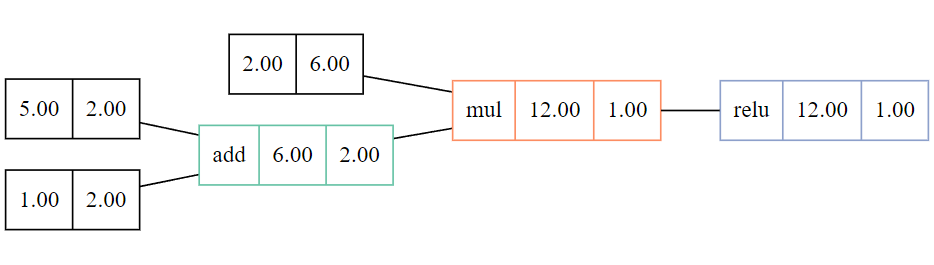
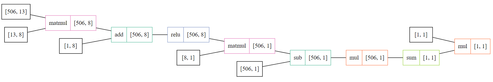

# rust-micrograd

Rust implementation of [Karpathy's micrograd](https://github.com/karpathy/micrograd), a small automatic differentiation engine.

The `value` module contains a scalar-only implementation, based on Karpathy's work.
> A tiny Autograd engine. Implements backpropagation (reverse-mode autodiff) over a dynamically built DAG and a small neural networks library on top of it with a PyTorch-like API. The DAG only operates over scalar values. Useful for educational purposes.

The `tensor` module contains a tiny matrix-based implementation, having more resemblance to PyTorch.
More efficient than `value`.

## Examples

See the [examples](./examples/) folder for examples of training a neural network on the `housing` dataset.  
- `cargo run -r --example tensor_mlp`

Example using `Value`:
```rust
let v1 = Value::from(5.0);
let v2 = Value::from(1.0);
let v3 = &v1 + &v2;
let v4 = 2.0 * &v3;
let mut v5 = v4.relu();
v5.backward();
assert_eq!(v1.grad(), 2.0);
assert_eq!(v2.grad(), 2.0);
```

## Visualizations

Call `Value::to_graphviz` or `Tensor::to_graphviz` to get a graphviz representation of the computation graph.





## Performance

Despite performance not being the focus of this project, rust does a good job of being fast.

Training loop time on the example `housing` dataset (without `print` statements) using the same MLP architecture:  
- `cargo run -r --example value_mlp`  
- `cargo run -r --example tensor_mlp`  
- `python .\examples\pytorch_mlp.py`

All implementations achieve the "same" final loss.

1000 iterations:  

|  Value  |  Tensor  | PyTorch |
|---------|----------|---------|
| 147.8s  | 0.2698s  | 0.6665s |

10000 iterations:  

| Tensor  | PyTorch |
|---------|---------|
| 1.393s  | 7.677s  |

## Setup

- Clone the project
- Build the project: `cargo build`
- Test the project: `cargo test`
- Run an example: `cargo run -r --example tensor_mlp`
- View documentation: `cargo doc --open`

### Docker (optional)

- Build the image: `docker build -t rust-micrograd .`  
- Run the container: `docker run -it --rm rust-micrograd /bin/bash`
  - Mount (for development purposes): 
`docker run --mount type=bind,src="$(pwd)/src",target=/micrograd/src -it --rm rust-micrograd /bin/bash`
